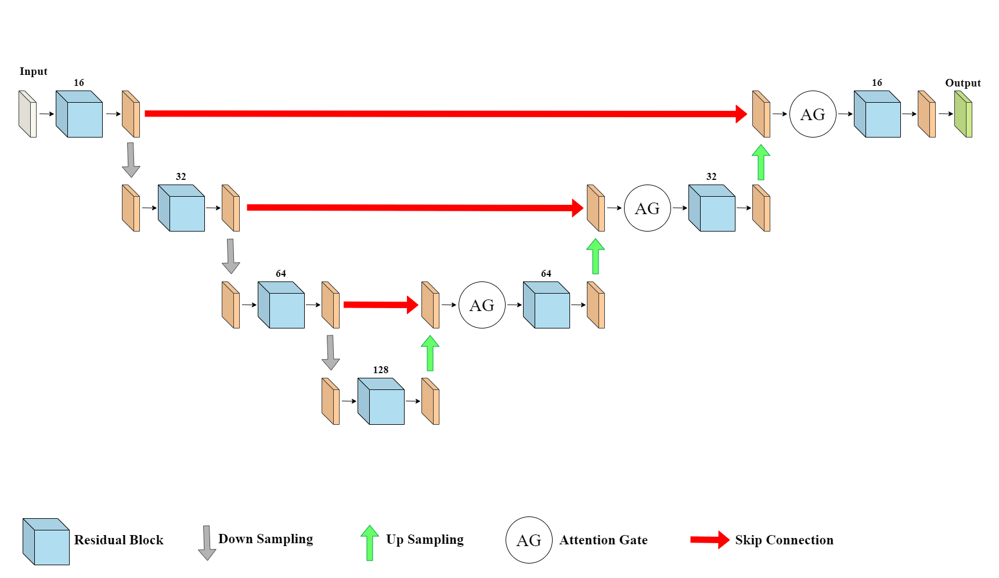
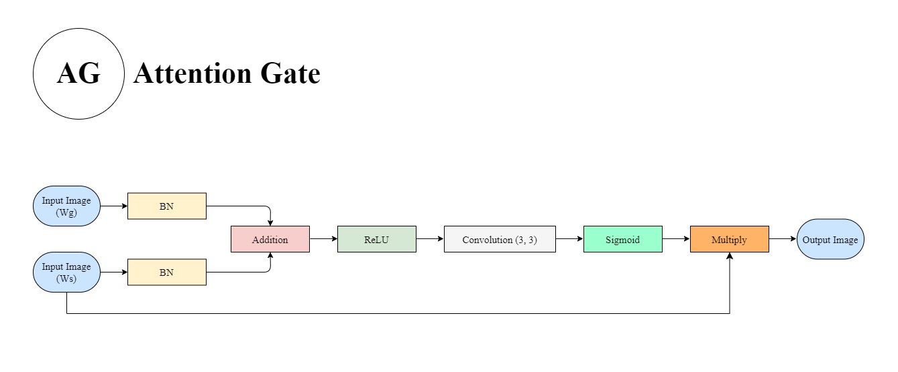
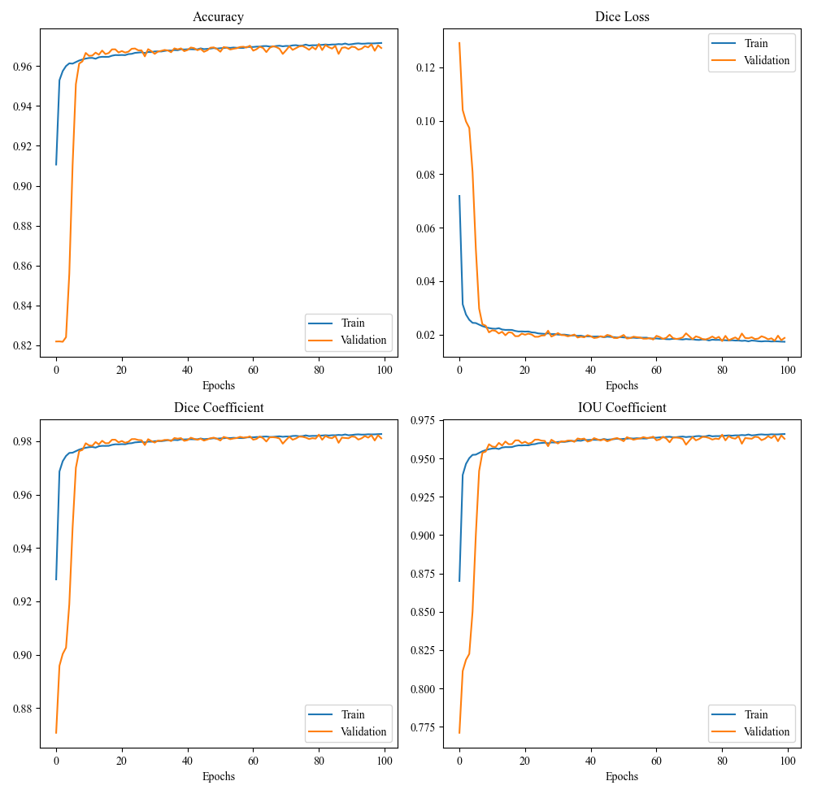
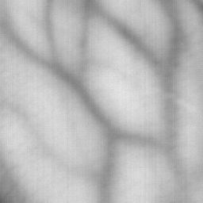
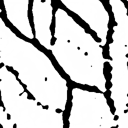

## Attention-Gate-Residual-UNet
This project implements a UNet-based model with Attention Gates and Residual Blocks for dorsal hand vein segmentation.

### Reference
- UNet Base: [U-Net: Convolutional Networks for Biomedical Image Segmentation](https://arxiv.org/abs/1505.04597)
- Modified UNet Code: [https://github.com/zhixuhao/unet](https://github.com/zhixuhao/unet)
- Attention Gate: [Attention U-Net: Learning Where to Look for the Pancreas](https://arxiv.org/abs/1804.03999)
- Residual Block: [Road Extraction by Deep Residual U-Net](https://arxiv.org/abs/1711.10684)

### Contents
- `data\` 
- `main.py`
- `data_loader.py`
- `blocks.py`
- `model.py`
- `my_metrics.py`
- `requirements.txt` - environment dependencies

## Dataset
The dataset is from [https://github.com/wilchesf/dorsalhandveins](https://github.com/wilchesf/dorsalhandveins). 

It contains 1,782 dorsal hand vein images, cropped to ROI, and split into:
- Train: `data/membrane/train/image` and `data/membrane/train/label`
- Validation: `data/membrane/val/val_image` and `data/membrane/val/val_label`
- Test: `data/membrane/test`

All images are resized to 256×256.

## Model Architecture
- Main structure:
  



- Residual block:


- Attention gate:




## Training Result



- Prediction example:

| Input Image | Prediction Image |
|-------------|------------------|
|  |  |

## Getting Start
To set up the environment (optional if already installed), run:
```
pip install -r .\requirements.txt
```
Replace image_path in vein_enhance.py with your input image path, then run:
```
python .\main.py 
```
